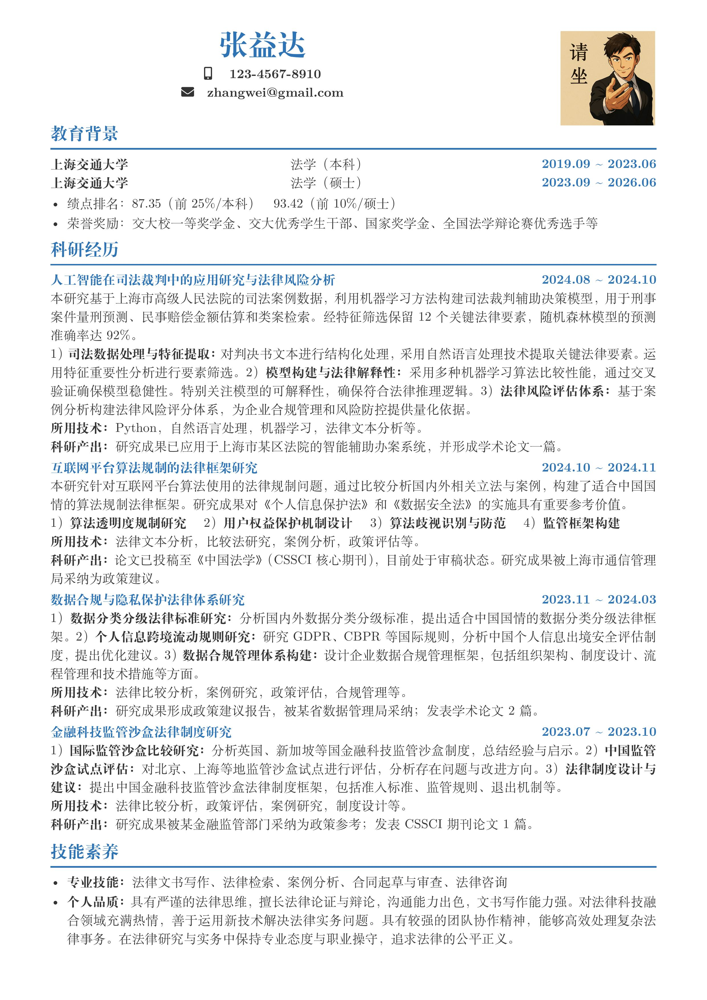

# LaTeX 中文简历模板

这是一个简洁的中文简历LaTeX模板，适配**在线LaTeX编辑器（如LoogTex）**，支持快速编译与PDF生成。
模板包含基础个人信息、教育背景、科研经历等模块，开箱即用。

---

## 📂 文件结构

```
Resume_Template/
├── Resume_template.tex     # 主LaTeX模板文件（在此编写简历内容）
└── images/
    └── zhangwei.png        # 示例头像图片（需替换为你的照片）
```

---

## 🛠️ 使用步骤

本人使用的[LoogTex](https://app.loongtex.com/workspace)编写的该模版

## ⚠️ 注意事项
- **头像替换**：确保图片路径正确，推荐使用**正方形PNG图片**避免变形。
- **内容调整**：根据需求删减模块。
- **字体依赖**：在线编辑无需处理字体。

## 📸 示例截图


### 关键点说明：

1. **适配LoogTex**：强调在线编辑器的兼容性，减少用户配置负担。
2. **文件结构清晰**：明确图片路径依赖，避免编译错误。
3. **头像替换提示**：突出用户需自行更换图片的步骤。
4. **本地/在线双方案**：覆盖不同使用场景，但优先引导在线编译简化流程。

---

本 README 文件由 DeepSeek 生成。

---